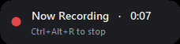
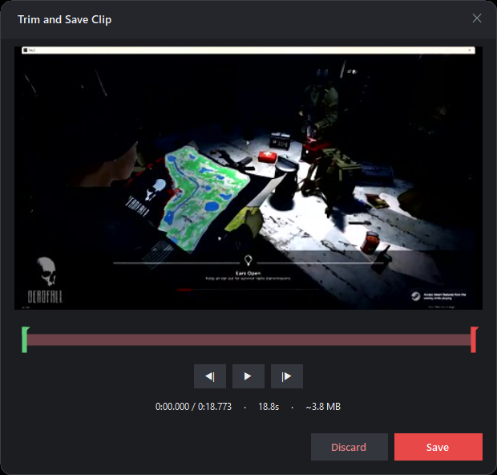
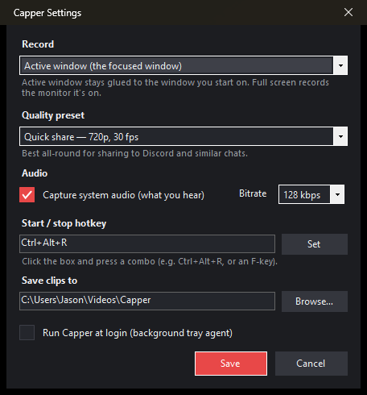

<p align="center">
  
</p>

<h1 align="center">Capper</h1>

<p align="center">
  A tiny Windows tray utility that records the <b>active window</b> to a short, share-ready MP4 clip.
</p>

<p align="center">
  
  
  
  
  <a href="LICENSE"></a>
</p>

## Overview

Capper lives in your system tray. A global hotkey **starts and stops** recording of the window you
have focused; when you stop, a dark **Trim and Save Clip** dialog plays the take back (video **and**
audio) so you can cut it to length and watch the estimated file size before you save. The output is a
single, fast-start MP4 that drops straight into a chat.

## Motivation

Most screen recorders are heavyweight, capture the whole desktop, and leave you to trim and
re-compress clips in a separate tool just to get under a chat app's upload cap. Capper is built for
one job: grabbing a quick clip of **one window** and getting it under **Discord's ~10 MB limit**
without installing ffmpeg or anything else. Capture, audio, trimming, and fast-start are **all native
Windows APIs** — nothing ships alongside the single `Capper.exe`.

## Screenshots

The unobtrusive **Now Recording** pill (bottom-center while capturing):



The **Trim and Save Clip** dialog — scrub, set in/out points, watch the estimated size, then save:



The **Settings** window (tray → Configure…):



## Features

- **One-window capture** — records the **active window** (stays glued to it, even through a
  fullscreen toggle and no matter what you click next) or the **whole screen** — your choice.
- **Just a hotkey** — press to start, press again (or click the pill) to stop. While recording, only a
  tiny non-activating **"Now Recording" pill** is shown, and it never appears in the clip.
- **System audio included** — records the system mix (what you hear) via WASAPI loopback, muxed into
  the same MP4, with silence gaps padded so A/V stays in sync.
- **Trim before you share** — a scrubbable preview with **real video + audio** playback, green/red
  in-out handles, frame-stepping, and a live **estimated file size**.
- **Quality presets** — one pick sets resolution, frame rate, and bitrate (see [How to use](#how-to-use)).
- **Share-ready output** — finished clips are rewritten **fast-start** (`moov` atom first) so they
  stream and scrub immediately.
- **Background agent** — optionally launches at login and waits quietly in the tray.
- **Zero external dependencies** — no ffmpeg, no shipped binaries.

## Built with

- **C# / .NET 9** (`net9.0-windows10.0.19041.0`), **WinForms** for the tray, pill, and dialogs.
- **Windows.Graphics.Capture** + **Direct3D 11** for capture and GPU downscaling.
- **Media Foundation** (`IMFSinkWriter`, `ICodecAPI`) for H.264 + AAC encoding.
- **Windows.Media.Editing** / **Windows.Media.Playback** for trimming and preview playback.
- **NAudio** for WASAPI loopback audio capture.
- **[Vortice.Windows](https://github.com/amerkoleci/Vortice.Windows)** for the D3D11 / DXGI / Media
  Foundation interop (compiled in, not shipped separately).

## How to use

1. Run `Capper.exe`. Capper's icon appears in the system tray. On **Windows 11**, new tray icons are
   hidden by default — click the **`^` overflow** chevron and drag Capper's icon onto the taskbar to
   pin it.
2. Focus the window you want to record and press the hotkey (default **Ctrl+Alt+R**). A small
   **Now Recording** pill appears bottom-center (showing the hotkey to stop) and the tray tooltip
   switches to "recording…".
3. Press the hotkey again (or click the pill) to finish.
4. The dark **Trim and Save Clip** dialog opens with a **video preview**:
   - Press **play** for real **video + audio** playback (bounded to your selected range); scrub the
     timeline or use the **frame-step** buttons to land on exact in/out points.
   - Drag the **green (start)** and **red (end)** handles to keep just the part you want — the preview
     follows the handle you drag, and the selection length and **estimated file size** are shown.
   - **Save** re-encodes the selected range into your output folder (with a **Cancel** button while it
     works); **Discard** throws the recording away; the **✕** keeps the full, untrimmed clip.

Files in your output folder name their state, so an in-progress recording is never mistaken for a
finished clip:

| Filename | State |
|----------|-------|
| `Capper-<date>.pending.mp4` | Currently recording, or waiting for you to trim/keep it |
| `Capper-<date>.trimming.mp4` | Being re-encoded while you Save |
| `Capper-<date>.mp4` | Finished clip — ready to share |

**Save** and **✕ (keep)** rename the file to the finished `Capper-<date>.mp4`; **Discard** deletes it.
Stray `.pending`/`.trimming` files from an interrupted session are cleaned up on the next launch.

> The REC pill never steals focus and — because Windows.Graphics.Capture records the target window's
> own surface — does **not** appear in your clip.

Right-click the tray icon for the menu:

| Item | What it does |
|------|--------------|
| Configure… | Opens the settings window |
| Open Output Folder | Opens where clips are saved |
| Quit | Exits |

### Settings (tray → Configure…)

Recording is **preset** — you just hotkey. Settings are saved in the tray's Configure window:

- **Record** — **Active window** (the focused window; stays glued to it through focus changes and
  fullscreen toggles) or **Full screen** (the whole monitor the focused window is on — best for
  exclusive-fullscreen games).
- **Quality preset** — one pick sets output resolution, frame rate, and bitrate:

  | Preset | Resolution | FPS | Bitrate | Use case |
  |--------|-----------:|----:|--------:|----------|
  | **Quick share** | 720p | 30 | ~2.5 Mbps | Default; drop straight into Discord-style chats |
  | **Long clip** | 480p | 30 | ~1.2 Mbps | Keep long recordings under the size limit |
  | **Gameplay** | 720p | 60 | ~6 Mbps | Smooth, fast motion |
  | **Tutorial** | 1080p | 30 | ~5 Mbps | Crisp text, menus, UI |
  | **Original** | source | 60 | ~16 Mbps | Max quality to keep locally or edit |

  Resolution is the target *height*; the source aspect ratio is preserved and never upscaled.
- **Audio** — capture the system mix (WASAPI loopback) on/off, plus AAC bitrate (96–192 kbps).
- **Hotkey** — click the box and press a combo (e.g. `Ctrl+Alt+R`, or an F-key).
- **Save clips to** — output folder (default `Videos\Capper`).
- **Run at login** — per-user startup entry so Capper is always in the tray.

There is no file-size setting — the **trim dialog** handles hitting a size after recording. Settings
persist to `%APPDATA%\Capper\config.json`.

## Installation

**End users:** download `Capper-win-Setup.exe` from the
[latest release](https://github.com/openface/Capper/releases/latest) and run it. It installs to your
user profile (no admin needed) and adds Start Menu/Desktop shortcuts. To update later, use
**Check for updates…** in the tray menu — if a newer version is available, Capper shows an
"Install update" item that downloads it and applies it on restart. (The installer is currently
unsigned, so Windows SmartScreen shows a one-time "More info → Run anyway" prompt.)

**Building from source:** requires the **.NET 9 SDK** (Windows). The project targets
`net9.0-windows10.0.19041.0`.

```sh
# Debug build / run
dotnet run

# Self-contained release into a folder (no runtime needed on the target machine)
dotnet publish -c Release -r win-x64 -o publish
# -> publish/Capper.exe (+ its dependencies)
```

If NuGet has no source configured on a fresh machine:

```sh
dotnet nuget add source https://api.nuget.org/v3/index.json -n nuget.org
```

## Releasing

Releases are built and published by GitHub Actions ([`.github/workflows/release.yml`](.github/workflows/release.yml))
using [Velopack](https://velopack.io). To cut a release, push a SemVer tag — the tag is the version:

```sh
git tag v1.2.0 && git push origin v1.2.0          # stable
git tag v1.2.0-rc.1 && git push origin v1.2.0-rc.1 # pre-release (hyphen -> marked pre-release)
```

The workflow runs the tests, publishes a self-contained build, then `vpk pack` produces the installer
plus full/delta update packages and an update manifest, and `vpk upload github` attaches them to the
GitHub Release. Installed copies pick up the update from that manifest automatically.

## Running the tests

The dependency-free units (clip-file naming/lifecycle, config + preset migration, and the MP4
fast-start rewriter) have a small headless test runner:

```sh
dotnet run --project tests/Capper.Tests
# prints PASS/FAIL per check and exits non-zero on any failure
```

It can also fast-start a real clip in place to sanity-check the rewriter against actual files:

```sh
dotnet run --project tests/Capper.Tests -- path/to/clip.mp4
```

## How it works

| Concern | Implementation |
|---------|----------------|
| Capture target | Active window → `CreateForWindow` (at hotkey time); Full screen → `CreateForMonitor` on the focused window's monitor |
| Capture | `Windows.Graphics.Capture` free-threaded frame pool (Direct3D 11, BGRA). Follows the target's size changes (`ContentSize` → `Recreate`) and auto-stops when a captured window closes |
| Audio | NAudio `WasapiLoopbackCapture` (system mix) → 16-bit PCM → AAC stream in the same MP4. Silence gaps (loopback delivers no packets while nothing plays) are padded to keep A/V in sync |
| Encode | Media Foundation `IMFSinkWriter` → H.264 + AAC / MP4. The encoder is tuned for quality-per-byte: **High profile** (CABAC + 8×8 transform), **B-frames**, **peak-constrained VBR** (mean = preset bitrate, peak up to 2× so hard frames — motion, foliage — can borrow bits without macroblocking), and a quality-leaning speed setting, all configured via the encoder's `ICodecAPI` (`H264EncoderConfig`) instead of the Baseline/CBR default. Each property is `IsSupported`-guarded, so an unsupported one is skipped, never fatal |
| Resolution scaling | A Direct3D 11 video processor (`FrameScaler`) GPU-downscales each frame to the preset resolution (aspect-preserved, letterboxed), so the per-frame CPU readback is the small output size. If it can't be created, Media Foundation scales during encode instead |
| Preview playback | `Windows.Media.Playback.MediaPlayer` in **frame-server** mode (`VideoPreviewPlayer`) — audio plays through the default device; each decoded frame is copied via `CopyFrameToVideoSurface` into a D3D11 texture and shown. Paused scrubbing uses `MediaComposition.GetThumbnailAsync` |
| Trim | `Windows.Media.Editing.MediaComposition` re-encodes the selected range (cancelable) |
| Fast-start | Finished clips are rewritten with the `moov` atom in front (`FastStart`) so they stream/scrub immediately — no ffmpeg |
| Run at login | per-user `HKCU\…\Run` registry entry (`StartupManager`) |
| Constant frame rate | A dedicated encode thread writes the latest captured frame at the target fps, so clips stay valid even when the window is static |
| Tray / hotkey | WinForms `NotifyIcon` + Win32 `RegisterHotKey` on a message-only window |
| REC indicator | Borderless, topmost, **non-activating** (`WS_EX_NOACTIVATE`) pill; not captured by WGC, so it can float over the recorded window |
| Interop | [Vortice.Windows](https://github.com/amerkoleci/Vortice.Windows) (D3D11/DXGI/Media Foundation) — compiled in, not shipped as a separate binary |

## Notes & limitations

- Records at the **preset's** resolution (the source is downscaled, never upscaled, aspect preserved);
  trimming preserves that resolution and only changes duration.
- **Active window** capture is focus- and occlusion-proof: it keeps recording the window you started
  on no matter what you click, and windows stacked on top of it don't appear. It follows the window
  through resizes/fullscreen toggles — with any downscaling preset the GPU scaler rescales the new
  size to fit (letterboxed); only **Original quality** (no scaling) crops/letterboxes a mid-recording
  resize. For exclusive-fullscreen games, use **Full screen** mode (whole-monitor capture).
- Audio is the **system mix** (loopback), not per-window — it captures everything you hear. Microphone
  capture is intentionally not included. Requires a 44.1/48 kHz device (the norm); other rates fall
  back to video-only. Silence gaps are padded so A/V stays in sync even on very quiet clips.
- Trimming snaps precisely (re-encode), so very long recordings take a few seconds to export; the Save
  dialog shows progress and can be cancelled.
- Some windows that block capture (certain DRM/secure surfaces) can't be recorded.

## Contributing

Issues and pull requests are welcome. Before opening a PR:

1. Build the app — `dotnet build` (requires the .NET 9 SDK on Windows).
2. Run the tests — `dotnet run --project tests/Capper.Tests` (they must stay green).
3. Keep changes focused and match the surrounding code style.

## Credits

- [Vortice.Windows](https://github.com/amerkoleci/Vortice.Windows) — the D3D11 / DXGI / Media
  Foundation interop that makes the native pipeline possible.
- [NAudio](https://github.com/naudio/NAudio) — WASAPI loopback audio capture.

## License

Released under the [MIT License](LICENSE).

MIT © jason@devtwo.com
